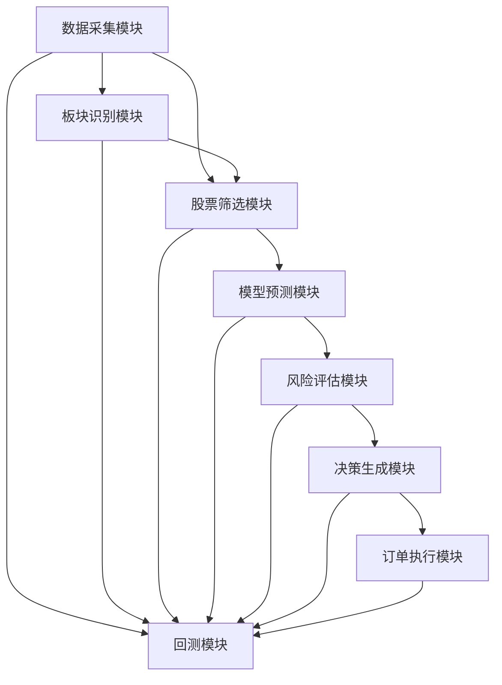

# 竞价打板策略模块接口规范

## 1. 概述

本规范定义了A股竞价涨停策略框架各功能模块的接口标准，包括输入输出格式、参数要求、数据结构和异常处理机制。通过实施此规范，确保每个模块具备独立的功能边界和清晰的接口定义，为后续针对各模块进行单独的性能优化、算法改进和功能扩展奠定基础。

## 2. 模块分类与依赖关系

### 2.1 核心模块列表

| 模块名称 | 主要功能 | 文件路径 | 依赖模块 |
|---------|---------|---------|---------|
| 数据采集模块 | 采集集合竞价数据 | `data/data_collector.py` | `data/data_source.py` |
| 板块识别模块 | 识别热门板块 | `strategy/sector_recognizer.py` | `data/data_source.py` |
| 股票筛选模块 | 筛选优质个股 | `strategy/stock_filter.py` | `data/data_source.py` |
| 模型预测模块 | 预测个股涨跌 | `strategy/model_predictor.py` | - |
| 风险评估模块 | 评估投资风险 | `strategy/risk_evaluator.py` | - |
| 决策生成模块 | 生成交易决策 | `strategy/decision_generator.py` | `strategy/risk_evaluator.py` |
| 订单执行模块 | 执行交易订单 | `strategy/order_execution.py` | - |
| 回测模块 | 历史回测验证 | `strategy/backtest.py` | 所有核心模块 |

### 2.2 模块依赖关系

## 3. 模块接口详细规范

### 3.1 数据采集模块 (DataCollector)

#### 3.1.1 核心方法接口

| 方法名 | 功能描述 | 输入参数 | 输出参数 | 异常处理 |
|-------|---------|---------|---------|---------|
| `collect_bidding_data` | 采集集合竞价数据 | `start_time: str` (必填) - 开始时间，格式："%H:%M"
`end_time: str` (必填) - 结束时间，格式："%H:%M" | `pd.DataFrame` - 采集的数据，包含所有股票的竞价信息 | 1. 数据采集失败：返回空DataFrame，记录ERROR日志
2. 数据质量不达标：返回最后一次采集结果，记录WARNING日志
3. 超时：返回空DataFrame，记录ERROR日志 |
| `get_data` | 获取采集的数据 | 无 | `pd.DataFrame` - 采集的数据 | 数据未采集：返回空DataFrame |
| `clear_data` | 清空存储的数据 | 无 | `None` | 无 |

#### 3.1.2 输入数据格式

| 参数名 | 类型 | 格式要求 | 示例 | 必填性 |
|-------|------|---------|------|--------|
| `start_time` | `str` | "%H:%M" | "09:15" | 必填 |
| `end_time` | `str` | "%H:%M" | "09:25" | 必填 |

#### 3.1.3 输出数据结构

| 字段名 | 数据类型 | 含义 | 示例 |
|-------|---------|------|------|
| `stock_code` | `str` | 股票代码 | "600000.SH" |
| `price_bid_price` | `float` | 竞价价格 | 15.23 |
| `price_bid_change` | `float` | 竞价涨跌幅 | 0.085 |
| `volume_bid_volume` | `int` | 竞价成交量 | 500000 |
| `volume_bid_volume_ratio` | `float` | 竞价成交量比 | 2.5 |
| `fund_flow_net_flow` | `int` | 资金净流入 | 10000000 |
| `order_book_bid_order_amount` | `int` | 买单金额 | 50000000 |
| `sector` | `str` | 所属板块 | "金融" |

### 3.2 板块识别模块 (SectorRecognizer)

#### 3.2.1 核心方法接口

| 方法名 | 功能描述 | 输入参数 | 输出参数 | 异常处理 |
|-------|---------|---------|---------|---------|
| `evaluate_sectors` | 评估板块热度 | `bidding_data: pd.DataFrame` (必填) - 集合竞价数据 | `pd.DataFrame` - 排序后的热门板块 | 输入数据为空：返回空DataFrame，记录ERROR日志 |
| `get_top_sectors` | 获取筛选出的TOP热门板块 | 无 | `pd.DataFrame` - TOP热门板块 | 未执行评估：返回空DataFrame |
| `get_sector_metrics` | 获取各板块的指标 | 无 | `dict` - 各板块的指标字典 | 未执行评估：返回空字典 |

#### 3.2.2 输入数据格式

| 参数名 | 类型 | 格式要求 | 必填性 |
|-------|------|---------|--------|
| `bidding_data` | `pd.DataFrame` | 必须包含`stock_code`、`sector`及相关指标列 | 必填 |

#### 3.2.3 输出数据结构

| 字段名 | 数据类型 | 含义 | 示例 |
|-------|---------|------|------|
| `sector` | `str` | 板块名称 | "金融" |
| `composite_score` | `float` | 综合热度评分 | 0.85 |
| `hotness_level` | `str` | 热度等级 | "A级热度" |
| `hotness_rank` | `int` | 热度排名 | 1 |
| `stock_count` | `int` | 板块股票数量 | 25 |
| `avg_price_change` | `float` | 板块平均涨跌幅 | 0.065 |
| `limit_up_density` | `float` | 涨停密度 | 0.2 |
| `selection_reason` | `str` | 筛选理由 | "综合评分极高(0.85); 涨停密度高(20%)" |

### 3.3 股票筛选模块 (StockFilter)

#### 3.3.1 核心方法接口

| 方法名 | 功能描述 | 输入参数 | 输出参数 | 异常处理 |
|-------|---------|---------|---------|---------|
| `filter_stocks` | 在热门板块内筛选个股 | `bidding_data: pd.DataFrame` (必填) - 集合竞价数据 `top_sectors: pd.DataFrame` (必填) - TOP热门板块 `historical_data: dict` (可选) - 历史数据字典 | `pd.DataFrame` - 个股候选池 | 输入数据为空：返回空DataFrame，记录ERROR日志 |
| `rank_candidate_stocks` | 对候选个股进行排序 | `candidate_stocks: pd.DataFrame` (可选) - 候选个股 | `pd.DataFrame` - 排序后的候选个股 | 候选池为空：返回空DataFrame |
| `filter_top_stocks` | 筛选TOP个股 | `ranked_stocks: pd.DataFrame` (可选) - 排序后的候选个股 `top_n: int` (可选，默认10) - 要筛选的TOP个股数量 | `pd.DataFrame` - TOP个股 | 候选池为空：返回空DataFrame |

#### 3.3.2 输入数据格式

| 参数名 | 类型 | 格式要求 | 必填性 |
|-------|------|---------|--------|
| `bidding_data` | `pd.DataFrame` | 必须包含`stock_code`、`sector`及相关指标列 | 必填 |
| `top_sectors` | `pd.DataFrame` | 必须包含`sector`列 | 必填 |
| `historical_data` | `dict` | 键为股票代码，值为历史数据DataFrame | 可选 |

#### 3.3.3 输出数据结构

| 字段名 | 数据类型 | 含义 | 示例 |
|-------|---------|------|------|
| `stock_code` | `str` | 股票代码 | "600000.SH" |
| `sector` | `str` | 所属板块 | "金融" |
| `price_bid_price` | `float` | 竞价价格 | 15.23 |
| `price_bid_change` | `float` | 竞价涨跌幅 | 0.085 |
| `stock_score` | `float` | 个股综合评分 | 85.5 |
| `stock_rank` | `int` | 个股排名 | 1 |
| `selection_reason` | `str` | 筛选理由 | "价格异动8.5%; 成交量比2.5倍" |

### 3.4 模型预测模块 (ModelPredictor)

#### 3.4.1 核心方法接口

| 方法名 | 功能描述 | 输入参数 | 输出参数 | 异常处理 |
|-------|---------|---------|---------|---------|
| `predict` | 预测个股涨跌 | `features: pd.DataFrame` (必填) - 个股特征数据 | `pd.DataFrame` - 预测结果 | 模型加载失败：返回空DataFrame，记录ERROR日志 特征数据不匹配：返回空DataFrame，记录ERROR日志 |
| `load_model` | 加载预训练模型 | 无 | `object` - 加载的模型对象 | 模型文件不存在：返回None，记录WARNING日志 |
| `get_feature_importance` | 获取特征重要性 | `features: pd.DataFrame` (必填) - 特征数据 | `pd.DataFrame` - 特征重要性 | 模型未加载：返回空DataFrame，记录ERROR日志 |

#### 3.4.2 输入数据格式

| 参数名 | 类型 | 格式要求 | 必填性 |
|-------|------|---------|--------|
| `features` | `pd.DataFrame` | 必须包含模型所需的所有特征列 | 必填 |

#### 3.4.3 输出数据结构

| 字段名 | 数据类型 | 含义 | 示例 |
|-------|---------|------|------|
| `stock_code` | `str` | 股票代码 | "600000.SH" |
| `probability` | `float` | 上涨概率 | 0.85 |
| `prediction` | `int` | 预测结果 | 1 |
| `confidence` | `float` | 预测置信度 | 0.92 |
| `feature_importance` | `dict` | 特征重要性 | {"price_change": 0.35, "volume_ratio": 0.25} |

### 3.5 风险评估模块 (RiskEvaluator)

#### 3.5.1 核心方法接口

| 方法名 | 功能描述 | 输入参数 | 输出参数 | 异常处理 |
|-------|---------|---------|---------|---------|
| `evaluate_risk` | 评估个股风险 | `stocks: pd.DataFrame` (必填) - 个股数据 `model_preds: pd.DataFrame` (必填) - 模型预测结果 | `pd.DataFrame` - 风险评估结果 | 输入数据为空：返回空DataFrame，记录ERROR日志 |
| `calculate_risk_score` | 计算风险评分 | `stock_data: pd.Series` (必填) - 单只股票数据 | `float` - 风险评分 | 数据缺失：返回0，记录WARNING日志 |
| `get_stop_loss_params` | 获取止损参数 | `stock_code: str` (必填) - 股票代码 `position_size: float` (必填) - 持仓大小 | `dict` - 止损参数 | 无 |

#### 3.5.2 输入数据格式

| 参数名 | 类型 | 格式要求 | 必填性 |
|-------|------|---------|--------|
| `stocks` | `pd.DataFrame` | 必须包含`stock_code`及相关风险指标列 | 必填 |
| `model_preds` | `pd.DataFrame` | 必须包含`stock_code`、`probability`列 | 必填 |
| `stock_data` | `pd.Series` | 包含单只股票的所有风险指标 | 必填 |
| `position_size` | `float` | 0 < position_size <= 1 | 必填 |

#### 3.5.3 输出数据结构

| 字段名 | 数据类型 | 含义 | 示例 |
|-------|---------|------|------|
| `stock_code` | `str` | 股票代码 | "600000.SH" |
| `risk_score` | `float` | 风险评分 | 0.35 |
| `risk_level` | `str` | 风险等级 | "低风险" |
| `stop_loss_price` | `float` | 止损价格 | 14.5 |
| `take_profit_price` | `float` | 止盈价格 | 16.8 |
| `risk_factors` | `dict` | 风险因素 | {"volatility": 0.2, "liquidity": 0.8} |

### 3.6 决策生成模块 (DecisionGenerator)

#### 3.6.1 核心方法接口

| 方法名 | 功能描述 | 输入参数 | 输出参数 | 异常处理 |
|-------|---------|---------|---------|---------|
| `generate_decisions` | 生成交易决策 | `risk_evaluated_stocks: pd.DataFrame` (必填) - 风险评估后的个股数据 | `pd.DataFrame` - 交易决策 | 输入数据为空：返回空DataFrame，记录ERROR日志 |
| `filter_top_decisions` | 筛选TOP决策 | `decisions: pd.DataFrame` (必填) - 交易决策 `top_n: int` (可选，默认5) - 要筛选的TOP决策数量 | `pd.DataFrame` - TOP交易决策 | 决策列表为空：返回空DataFrame |
| `calculate_position_size` | 计算仓位大小 | `stock_data: pd.Series` (必填) - 股票数据 `risk_score: float` (必填) - 风险评分 | `float` - 仓位比例 | 无 |

#### 3.6.2 输入数据格式

| 参数名 | 类型 | 格式要求 | 必填性 |
|-------|------|---------|--------|
| `risk_evaluated_stocks` | `pd.DataFrame` | 必须包含`stock_code`、`risk_score`、`probability`列 | 必填 |
| `decisions` | `pd.DataFrame` | 必须包含`stock_code`、`action`、`score`列 | 必填 |
| `stock_data` | `pd.Series` | 包含股票的基本信息和风险指标 | 必填 |
| `risk_score` | `float` | 0 <= risk_score <= 1 | 必填 |

#### 3.6.3 输出数据结构

| 字段名 | 数据类型 | 含义 | 示例 |
|-------|---------|------|------|
| `stock_code` | `str` | 股票代码 | "600000.SH" |
| `action` | `str` | 交易方向 | "buy" |
| `price` | `float` | 交易价格 | 15.23 |
| `quantity` | `int` | 交易数量 | 10000 |
| `position_ratio` | `float` | 仓位比例 | 0.05 |
| `score` | `float` | 决策评分 | 92.5 |
| `decision_time` | `datetime` | 决策时间 | 2025-01-01 09:25:00 |

### 3.7 订单执行模块 (OrderExecution)

#### 3.7.1 核心方法接口

| 方法名 | 功能描述 | 输入参数 | 输出参数 | 异常处理 |
|-------|---------|---------|---------|---------|
| `execute_order` | 执行交易订单 | `order: dict` (必填) - 交易订单 `order_type: str` (可选，默认"limit") - 订单类型 | `dict` - 执行结果 | 订单参数无效：返回空字典，记录ERROR日志 执行失败：返回失败结果，记录ERROR日志 |
| `cancel_order` | 撤销订单 | `order_id: str` (必填) - 订单ID | `bool` - 撤销结果 | 订单不存在：返回False，记录WARNING日志 |
| `query_order_status` | 查询订单状态 | `order_id: str` (必填) - 订单ID | `dict` - 订单状态 | 订单不存在：返回空字典，记录WARNING日志 |

#### 3.7.2 输入数据格式

| 参数名 | 类型 | 格式要求 | 必填性 |
|-------|------|---------|--------|
| `order` | `dict` | 包含`stock_code`、`action`、`price`、`quantity`字段 | 必填 |
| `order_type` | `str` | "limit"或"market" | 可选 |
| `order_id` | `str` | 订单唯一标识符 | 必填 |

#### 3.7.3 输出数据结构

| 字段名 | 数据类型 | 含义 | 示例 |
|-------|---------|------|------|
| `order_id` | `str` | 订单ID | "ORD202501010001" |
| `stock_code` | `str` | 股票代码 | "600000.SH" |
| `action` | `str` | 交易方向 | "buy" |
| `status` | `str` | 执行状态 | "filled" |
| `executed_price` | `float` | 实际成交价格 | 15.25 |
| `executed_quantity` | `int` | 实际成交数量 | 10000 |
| `execution_time` | `datetime` | 执行时间 | 2025-01-01 09:30:00 |
| `commission` | `float` | 交易佣金 | 7.63 |

### 3.8 回测模块 (Backtest)

#### 3.8.1 核心方法接口

| 方法名 | 功能描述 | 输入参数 | 输出参数 | 异常处理 |
|-------|---------|---------|---------|---------|
| `run` | 运行历史回测 | `features: pd.DataFrame` (必填) - 历史特征数据 | `dict` - 回测结果 | 输入数据为空：返回空字典，记录ERROR日志 |
| `_calculate_backtest_metrics` | 计算回测指标 | 无 | `dict` - 回测指标 | 无 |
| `_generate_backtest_report` | 生成回测报告 | 无 | `None` | 报告生成失败：记录ERROR日志 |

#### 3.8.2 输入数据格式

| 参数名 | 类型 | 格式要求 | 必填性 |
|-------|------|---------|--------|
| `features` | `pd.DataFrame` | 必须包含`stock_code`、`date`、`label`列及相关特征列 | 必填 |

#### 3.8.3 输出数据结构

| 字段名 | 数据类型 | 含义 | 示例 |
|-------|---------|------|------|
| `total_return` | `float` | 总收益率 | 0.256 |
| `annual_return` | `float` | 年化收益率 | 0.385 |
| `sharpe_ratio` | `float` | 夏普比率 | 2.5 |
| `max_drawdown` | `float` | 最大回撤 | -0.15 |
| `win_rate` | `float` | 胜率 | 0.65 |
| `profit_loss_ratio` | `float` | 盈亏比 | 2.2 |
| `trade_count` | `int` | 交易次数 | 120 |
| `information_ratio` | `float` | 信息比率 | 1.8 |
| `beta` | `float` | 贝塔系数 | 1.2 |
| `alpha` | `float` | 阿尔法系数 | 0.05 |

## 4. 模块间数据传递协议

### 4.1 数据格式统一规范

1. **股票代码格式**：统一使用带后缀的格式，如"600000.SH"表示上海A股，"000001.SZ"表示深圳A股
2. **日期时间格式**：日期使用"%Y-%m-%d"格式，时间使用"%H:%M"格式，完整时间戳使用"%Y-%m-%d %H:%M:%S"格式
3. **数值类型**：
   - 价格、涨跌幅等使用`float`类型
   - 成交量、订单数量等使用`int`类型
   - 比例、概率等使用`float`类型，并限制在[0, 1]范围内
4. **板块名称**：统一使用中文全称，如"金融"、"医药生物"
5. **数据缺失处理**：缺失值使用`np.nan`表示，布尔值缺失使用`None`表示

### 4.2 数据传递机制

1. **同步调用**：模块间方法调用采用同步方式，确保数据完整性和一致性
2. **数据验证**：每个模块在接收输入数据时，必须进行格式验证和有效性检查
3. **异常处理**：模块间调用发生异常时，应返回明确的错误信息，并记录详细日志
4. **数据缓存**：模块内部可根据需要缓存数据，但必须设置合理的过期时间
5. **日志记录**：所有模块间的数据传递必须记录详细日志，包括输入输出数据摘要

### 4.3 数据版本管理

1. **版本标识**：重要数据应包含版本号，如`data_version: "1.0"`
2. **兼容性处理**：模块应支持向后兼容，能够处理旧版本数据
3. **数据迁移**：当数据格式发生重大变化时，必须提供数据迁移工具

## 5. 异常处理与日志规范

### 5.1 异常处理原则

1. **明确性**：异常信息应明确说明错误原因和位置
2. **分级处理**：根据严重程度分为ERROR、WARNING、INFO、DEBUG四个级别
3. **容错机制**：模块应具备容错能力，在遇到非致命错误时能够继续执行
4. **恢复机制**：关键模块应具备自动恢复能力，如数据采集模块的重试机制

### 5.2 日志记录规范

1. **日志格式**：统一使用JSON格式，包含时间戳、模块名、级别、消息、详细信息等字段
2. **日志级别**：
   - ERROR：严重错误，导致模块无法正常工作
   - WARNING：警告信息，可能影响模块性能或结果
   - INFO：常规信息，记录模块运行状态
   - DEBUG：调试信息，用于开发和调试
3. **日志存储**：日志文件应按日期和模块分类存储，保留期限至少30天
4. **日志内容**：
   - 模块启动和关闭信息
   - 数据采集和处理结果
   - 模型训练和预测结果
   - 交易决策和执行结果
   - 异常信息和错误堆栈

## 6. 接口扩展与版本管理

### 6.1 接口扩展原则

1. **向后兼容**：新接口必须兼容旧接口，确保现有代码无需修改即可继续工作
2. **最小化改动**：接口扩展应尽量减少对现有代码的影响
3. **明确标识**：新增参数应使用默认值，确保旧代码可以正常调用
4. **文档更新**：接口扩展后必须及时更新文档

### 6.2 版本管理规范

1. **版本号格式**：采用语义化版本号，格式为"MAJOR.MINOR.PATCH"
   - MAJOR：不兼容的API修改
   - MINOR：向后兼容的功能新增
   - PATCH：向后兼容的问题修复
2. **版本依赖**：每个模块应明确指定依赖的其他模块版本
3. **版本检查**：模块在初始化时应检查依赖模块的版本兼容性
4. **发布流程**：新版本发布前必须进行全面测试，确保接口兼容性

## 7. 测试与验证规范

### 7.1 单元测试

1. **测试覆盖**：每个模块的核心方法必须编写单元测试，覆盖率不低于80%
2. **测试数据**：使用真实场景的模拟数据，确保测试的真实性
3. **测试断言**：每个测试用例必须包含明确的断言，验证输出结果
4. **测试报告**：生成详细的测试报告，包含覆盖率、通过率等指标

### 7.2 集成测试

1. **模块集成**：测试模块间的协作关系，确保数据传递正确
2. **场景测试**：模拟真实交易场景，测试整个流程的正确性
3. **性能测试**：测试系统在高并发下的性能表现
4. **稳定性测试**：长时间运行测试，验证系统的稳定性

### 7.3 回测验证

1. **历史数据**：使用真实历史数据进行回测
2. **回测指标**：计算完整的回测指标，包括收益率、风险指标等
3. **回测报告**：生成详细的回测报告，包含资金曲线、交易记录等
4. **参数敏感性分析**：测试不同参数设置对策略表现的影响

## 8. 总结

本规范定义了竞价打板策略框架各功能模块的标准化接口，确保系统各部分能够协同工作，同时保持独立的功能边界。通过实施此规范，可以提高系统的可维护性、可扩展性和可靠性，为后续的性能优化、算法改进和功能扩展奠定基础。

本规范将作为系统开发、测试和维护的重要依据，所有相关开发人员必须严格遵守。

## 9. 附录

### 9.1 术语定义

| 术语 | 含义 |
|------|------|
| 集合竞价 | A股市场在每个交易日的9:15-9:25进行的竞价交易 |
| 竞价涨停 | 集合竞价阶段价格达到涨停价的股票 |
| 板块 | 具有相同或相似特征的股票集合，如行业板块、概念板块等 |
| 热度 | 衡量板块或个股受市场关注程度的指标 |
| 夏普比率 | 衡量投资组合风险调整后收益的指标 |
| 最大回撤 | 投资组合在特定时期内从最高点到最低点的最大跌幅 |
| 胜率 | 盈利交易次数占总交易次数的比例 |
| 盈亏比 | 平均盈利金额与平均亏损金额的比值 |

### 9.2 参考文档

1. 《Python接口设计最佳实践》
2. 《量化交易系统架构设计》
3. 《金融数据接口规范》
4. 《机器学习模型接口设计》
