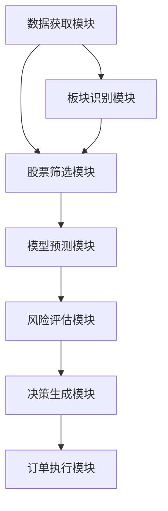

# 竞价打板策略模块标准化输入输出规范

## 1. 概述

本规范定义了A股竞价涨停策略框架各功能模块的标准化输入输出接口，包括数据获取、板块识别、股票筛选、模型预测、风险评估、决策生成和订单执行等核心模块。通过实施此规范，确保系统各部分能够协同工作，同时保持独立的功能边界，为后续的性能优化、算法改进和功能扩展奠定基础。

## 2. 模块分类与依赖关系

### 2.1 核心模块列表

| 模块名称 | 主要功能 | 文件路径 | 依赖模块 |
|---------|---------|---------|---------|
| 数据获取模块 | 采集历史数据和集合竞价数据 | `strategy/data_fetch.py` | - |
| 板块识别模块 | 识别热门板块 | `strategy/sector_recognizer.py` | 数据获取模块 |
| 股票筛选模块 | 筛选优质个股 | `strategy/stock_filter.py` | 数据获取模块、板块识别模块 |
| 模型预测模块 | 预测个股涨跌 | `strategy/model_predictor.py` | - |
| 风险评估模块 | 评估投资风险 | `strategy/risk_evaluator.py` | 数据获取模块 |
| 决策生成模块 | 生成交易决策 | `strategy/decision_generator.py` | 模型预测模块、风险评估模块 |
| 订单执行模块 | 执行交易订单 | `strategy/order_execution.py` | 决策生成模块 |

### 2.2 模块依赖关系

## 3. 模块接口详细规范

### 3.1 数据获取模块 (DataFetcher)

#### 3.1.1 核心方法接口

| 方法名 | 功能描述 | 输入参数 | 输出参数 | 异常处理 |
|-------|---------|---------|---------|---------|
| `get_historical_data` | 获取历史数据 | `start_date: str` (必填) - 开始日期，格式："YYYYMMDD" `end_date: str` (必填) - 结束日期，格式："YYYYMMDD" `market: str` (可选，默认:"ALL") - 市场类型，可选值："SH"、"SZ"、"ALL" `batch_size: int` (可选，默认:50) - 分批处理的股票数量 | `Dict[str, pd.DataFrame]` - 历史数据字典，键为股票代码，值为历史数据DataFrame | 数据获取失败：返回空字典，记录ERROR日志 |
| `get_historical_data_dataframe` | 获取历史数据，返回合并的DataFrame | `start_date: str` (必填) - 开始日期，格式："YYYYMMDD" `end_date: str` (必填) - 结束日期，格式："YYYYMMDD" `market: str` (可选，默认:"ALL") - 市场类型 | `pd.DataFrame` - 合并的历史数据 | 数据获取失败：返回空DataFrame，记录ERROR日志 |
| `get_bid_data` | 获取指定日期的集合竞价数据 | `date: str` (必填) - 日期，格式："YYYYMMDD" | `Dict[str, pd.DataFrame]` - 集合竞价数据字典，键为股票代码，值为集合竞价数据 | 数据获取失败：返回空字典，记录ERROR日志 |

#### 3.1.2 输入数据格式

| 参数名 | 类型 | 格式要求 | 示例 | 必填性 |
|-------|------|---------|------|--------|
| `start_date` | `str` | "YYYYMMDD" | "20250101" | 必填 |
| `end_date` | `str` | "YYYYMMDD" | "20251231" | 必填 |
| `market` | `str` | "SH"、"SZ"、"ALL" | "ALL" | 可选 |
| `date` | `str` | "YYYYMMDD" | "20250801" | 必填 |

#### 3.1.3 输出数据结构

**历史数据字段**：

| 字段名 | 数据类型 | 含义 | 示例 |
|-------|---------|------|------|
| `stock_code` | `str` | 股票代码 | "600000.SH" |
| `trade_date` | `str` | 交易日期 | "20250101" |
| `open` | `float` | 开盘价 | 15.23 |
| `high` | `float` | 最高价 | 15.50 |
| `low` | `float` | 最低价 | 15.10 |
| `close` | `float` | 收盘价 | 15.45 |
| `volume` | `int` | 成交量 | 500000 |
| `amount` | `float` | 成交额 | 7725000 |

**集合竞价数据字段**：

| 字段名 | 数据类型 | 含义 | 示例 |
|-------|---------|------|------|
| `stock_code` | `str` | 股票代码 | "600000.SH" |
| `bid_price` | `float` | 竞价价格 | 15.23 |
| `bid_change` | `float` | 竞价涨跌幅 | 0.085 |
| `bid_volume` | `int` | 竞价成交量 | 500000 |
| `bid_amount` | `float` | 竞价金额 | 7725000 |
| `bid_turnover_rate` | `float` | 竞价换手率 | 0.005 |
| `bid_order_amount` | `float` | 封单金额 | 9270000 |
| `bid_order_ratio` | `float` | 封单比例 | 0.12 |

### 3.2 板块识别模块 (SectorRecognizer)

#### 3.2.1 核心方法接口

| 方法名 | 功能描述 | 输入参数 | 输出参数 | 异常处理 |
|-------|---------|---------|---------|---------|
| `evaluate_sectors` | 评估板块热度，筛选TOP热门板块 | `bidding_data: pd.DataFrame` (必填) - 集合竞价数据，包含所有股票的竞价信息 | `pd.DataFrame` - 排序后的热门板块DataFrame | 输入数据为空：返回空DataFrame，记录ERROR日志 |
| `get_top_sectors` | 获取筛选出的TOP热门板块 | 无 | `pd.DataFrame` - TOP热门板块DataFrame | 未执行评估：返回空DataFrame |
| `get_sector_metrics` | 获取各板块的指标 | 无 | `Dict[str, Dict]` - 各板块的指标字典 | 未执行评估：返回空字典 |

#### 3.2.2 输入数据格式

| 参数名 | 类型 | 格式要求 | 必填性 |
|-------|------|---------|--------|
| `bidding_data` | `pd.DataFrame` | 必须包含`stock_code`、`price_bid_change`、`volume_bid_volume`等竞价相关字段 | 必填 |

#### 3.2.3 输出数据结构

| 字段名 | 数据类型 | 含义 | 示例 |
|-------|---------|------|------|
| `sector` | `str` | 板块名称 | "金融" |
| `composite_score` | `float` | 综合热度评分 | 0.85 |
| `hotness_level` | `str` | 热度等级 | "S级热度" |
| `hotness_rank` | `int` | 热度排名 | 1 |
| `stock_count` | `int` | 板块股票数量 | 25 |
| `avg_price_change` | `float` | 板块平均涨跌幅 | 0.065 |
| `limit_up_density` | `float` | 涨停密度 | 0.2 |
| `selection_reason` | `str` | 筛选理由 | "综合评分极高(0.85); 涨停密度高(20%)" |
| `ranking_criteria` | `str` | 排序依据说明 | "排序依据：综合热度评分降序 > 涨停密度降序 > 资金流入相对强度降序" |

### 3.3 股票筛选模块 (StockFilter)

#### 3.3.1 核心方法接口

| 方法名 | 功能描述 | 输入参数 | 输出参数 | 异常处理 |
|-------|---------|---------|---------|---------|
| `filter_stocks` | 在热门板块内筛选个股 | `bidding_data: pd.DataFrame` (必填) - 集合竞价数据 `top_sectors: pd.DataFrame` (必填) - TOP热门板块DataFrame `historical_data: Dict[str, pd.DataFrame]` (可选) - 历史数据字典 | `pd.DataFrame` - 个股候选池DataFrame | 输入数据为空：返回空DataFrame，记录ERROR日志 |
| `rank_candidate_stocks` | 对候选个股进行排序 | `candidate_stocks: pd.DataFrame` (可选) - 候选个股DataFrame | `pd.DataFrame` - 排序后的候选个股DataFrame | 候选个股为空：返回空DataFrame |
| `filter_top_stocks` | 筛选TOP个股 | `ranked_stocks: pd.DataFrame` (可选) - 排序后的候选个股DataFrame `top_n: int` (可选，默认:10) - 要筛选的TOP个股数量 | `pd.DataFrame` - TOP个股DataFrame | 候选个股为空：返回空DataFrame |

#### 3.3.2 输入数据格式

| 参数名 | 类型 | 格式要求 | 必填性 |
|-------|------|---------|--------|
| `bidding_data` | `pd.DataFrame` | 必须包含`stock_code`、`sector`及相关竞价字段 | 必填 |
| `top_sectors` | `pd.DataFrame` | 必须包含`sector`列 | 必填 |
| `historical_data` | `Dict[str, pd.DataFrame]` | 键为股票代码，值为历史数据DataFrame | 可选 |

#### 3.3.3 输出数据结构

| 字段名 | 数据类型 | 含义 | 示例 |
|-------|---------|------|------|
| `stock_code` | `str` | 股票代码 | "600000.SH" |
| `sector` | `str` | 所属板块 | "金融" |
| `price_bid_price` | `float` | 竞价价格 | 15.23 |
| `price_bid_change` | `float` | 竞价涨跌幅 | 0.085 |
| `stock_score` | `float` | 个股综合评分 | 85.5 |
| `stock_rank` | `int` | 个股排名 | 1 |
| `selection_reason` | `str` | 筛选理由 | "价格异动8.5%; 成交量比2.5倍" |

### 3.4 模型预测模块 (ModelPredictor)

#### 3.4.1 核心方法接口

| 方法名 | 功能描述 | 输入参数 | 输出参数 | 异常处理 |
|-------|---------|---------|---------|---------|
| `predict` | 对候选个股进行多维度评估 | `candidate_stocks: pd.DataFrame` (必填) - 候选个股DataFrame `features: pd.DataFrame` (可选) - 用于预测的特征数据 | `pd.DataFrame` - 带有预测结果的候选个股DataFrame | 候选个股为空：返回空DataFrame，记录ERROR日志 |
| `train_models` | 训练模型 | `train_data: pd.DataFrame` (必填) - 训练数据 `target_column: str` (可选，默认:"is_limit_up") - 目标列名称 | `Dict[str, object]` - 训练好的模型字典 | 训练数据为空：返回空字典，记录ERROR日志 |
| `explain_predictions` | 使用SHAP解释预测结果 | `features: pd.DataFrame` (必填) - 特征数据 `predictions: pd.DataFrame` (可选) - 预测结果数据 `visualize: bool` (可选，默认:False) - 是否生成可视化结果 | `pd.DataFrame` - SHAP值DataFrame | 没有可用模型：返回空DataFrame，记录ERROR日志 |

#### 3.4.2 输入数据格式

| 参数名 | 类型 | 格式要求 | 必填性 |
|-------|------|---------|--------|
| `candidate_stocks` | `pd.DataFrame` | 必须包含`stock_code`及相关特征字段 | 必填 |
| `features` | `pd.DataFrame` | 必须包含模型所需的所有特征列 | 可选 |
| `train_data` | `pd.DataFrame` | 必须包含`target_column`及相关特征列 | 必填 |

#### 3.4.3 输出数据结构

| 字段名 | 数据类型 | 含义 | 示例 |
|-------|---------|------|------|
| `stock_code` | `str` | 股票代码 | "600000.SH" |
| `prediction_score` | `float` | 综合预测得分 | 0.85 |
| `limit_up_prob` | `float` | 当日封板成功率 | 0.85 |
| `next_day_premium` | `float` | 封板后次日溢价空间 | 0.05 |
| `rise_prob_30min` | `float` | 未来30分钟内上涨概率 | 0.85 |
| `prediction_confidence` | `float` | 预测置信度 | 0.92 |
| `rise_prob_30min_lower` | `float` | 未来30分钟内上涨概率置信区间下限 | 0.75 |
| `rise_prob_30min_upper` | `float` | 未来30分钟内上涨概率置信区间上限 | 0.95 |

### 3.5 风险评估模块 (RiskEvaluator)

#### 3.5.1 核心方法接口

| 方法名 | 功能描述 | 输入参数 | 输出参数 | 异常处理 |
|-------|---------|---------|---------|---------|
| `evaluate_risk` | 对候选个股进行风险评级 | `candidate_stocks: pd.DataFrame` (必填) - 候选个股DataFrame `market_data: pd.DataFrame` (可选) - 市场数据 | `pd.DataFrame` - 带有风险评级的候选个股DataFrame | 候选个股为空：返回空DataFrame，记录ERROR日志 |
| `get_risk_report` | 生成风险评估报告 | `risk_evaluated_stocks: pd.DataFrame` (必填) - 带有风险评级的候选个股DataFrame | `Dict[str, Any]` - 风险评估报告字典 | 输入数据为空：返回空字典，记录ERROR日志 |

#### 3.5.2 输入数据格式

| 参数名 | 类型 | 格式要求 | 必填性 |
|-------|------|---------|--------|
| `candidate_stocks` | `pd.DataFrame` | 必须包含`stock_code`及相关股票基本信息 | 必填 |
| `market_data` | `pd.DataFrame` | 包含市场情绪、波动率等市场数据 | 可选 |

#### 3.5.3 输出数据结构

| 字段名 | 数据类型 | 含义 | 示例 |
|-------|---------|------|------|
| `stock_code` | `str` | 股票代码 | "600000.SH" |
| `total_risk` | `float` | 综合风险评分 | 0.35 |
| `risk_level` | `str` | 风险等级 | "低风险" |
| `risk_alert` | `bool` | 风险预警状态 | False |
| `market_sentiment_risk` | `float` | 市场整体情绪风险 | 0.2 |
| `volatility_risk` | `float` | 个股历史波动率风险 | 0.3 |
| `liquidity_risk` | `float` | 流动性风险 | 0.15 |
| `policy_risk` | `float` | 政策风险 | 0.1 |
| `fund_flow_risk` | `float` | 资金流风险 | 0.2 |

### 3.6 决策生成模块 (DecisionGenerator)

#### 3.6.1 核心方法接口

| 方法名 | 功能描述 | 输入参数 | 输出参数 | 异常处理 |
|-------|---------|---------|---------|---------|
| `generate_decisions` | 生成投资决策建议 | `evaluated_stocks: pd.DataFrame` (必填) - 经过各模块评估的股票数据 | `pd.DataFrame` - 带有决策建议的股票数据 | 输入数据为空：返回空DataFrame，记录ERROR日志 |
| `filter_top_decisions` | 筛选TOP决策建议 | `decisions: pd.DataFrame` (必填) - 完整的决策建议数据 `top_n: int` (可选，默认:10) - 要筛选的TOP数量 | `pd.DataFrame` - TOP决策建议数据 | 输入数据为空：返回空DataFrame，记录ERROR日志 |
| `generate_decision_summary` | 生成决策建议摘要 | `decisions: pd.DataFrame` (必填) - 完整的决策建议数据 | `Dict[str, Any]` - 决策建议摘要字典 | 输入数据为空：返回空字典，记录ERROR日志 |

#### 3.6.2 输入数据格式

| 参数名 | 类型 | 格式要求 | 必填性 |
|-------|------|---------|--------|
| `evaluated_stocks` | `pd.DataFrame` | 必须包含`stock_code`、`prediction_score`、`total_risk`等评估结果字段 | 必填 |
| `decisions` | `pd.DataFrame` | 必须包含`decision_score`、`position_ratio`等决策相关字段 | 必填 |

#### 3.6.3 输出数据结构

| 字段名 | 数据类型 | 含义 | 示例 |
|-------|---------|------|------|
| `stock_code` | `str` | 股票代码 | "600000.SH" |
| `decision_score` | `float` | 综合决策得分 | 0.85 |
| `buy_priority` | `int` | 买入优先级 | 1 |
| `position_ratio` | `float` | 仓位比例 | 0.08 |
| `suggested_buy_price` | `float` | 建议买入价格 | 15.23 |
| `suggested_buy_quantity` | `int` | 建议买入数量 | 10000 |
| `take_profit_price` | `float` | 止盈价格 | 17.52 |
| `stop_loss_price` | `float` | 止损价格 | 14.32 |
| `trailing_stop_ratio` | `float` | 跟踪止损比例 | 0.08 |
| `profit_target` | `float` | 止盈目标 | 0.15 |
| `stop_loss_ratio` | `float` | 止损比例 | 0.06 |
| `risk_level` | `str` | 风险等级 | "低风险" |
| `decision_time` | `datetime` | 决策时间 | 2025-08-01 09:25:00 |

### 3.7 订单执行模块 (OrderExecutor)

#### 3.7.1 核心方法接口

| 方法名 | 功能描述 | 输入参数 | 输出参数 | 异常处理 |
|-------|---------|---------|---------|---------|
| `execute` | 执行交易订单 | `decisions: List[Dict]` (必填) - 交易决策列表 | `List[Dict]` - 订单执行结果列表 | 交易决策为空：返回空列表，记录WARNING日志 |
| `cancel_order` | 撤销订单 | `order_id: int` (必填) - 订单ID | `bool` - 撤销结果 | 订单不存在：返回False，记录WARNING日志 |
| `get_position` | 获取当前持仓 | 无 | `List[Dict]` - 当前持仓列表 | 交易客户端未初始化：返回None，记录ERROR日志 |
| `get_account` | 获取账户信息 | 无 | `Dict[str, Any]` - 账户信息字典 | 交易客户端未初始化：返回None，记录ERROR日志 |

#### 3.7.2 输入数据格式

| 参数名 | 类型 | 格式要求 | 必填性 |
|-------|------|---------|--------|
| `decisions` | `List[Dict]` | 每个决策必须包含`stock`、`action`、`price`等交易相关字段 | 必填 |
| `order_id` | `int` | 订单唯一标识符 | 必填 |

#### 3.7.3 输出数据结构

| 字段名 | 数据类型 | 含义 | 示例 |
|-------|---------|------|------|
| `stock` | `str` | 股票代码 | "600000.SH" |
| `action` | `str` | 交易方向 | "buy" |
| `price` | `float` | 交易价格 | 15.23 |
| `order_id` | `int` | 订单ID | 10001 |
| `status` | `str` | 执行状态 | "filled" |
| `quantity` | `int` | 交易数量 | 10000 |
| `filled_quantity` | `int` | 成交数量 | 10000 |
| `time` | `datetime` | 执行时间 | 2025-08-01 09:30:00 |
| `pnl` | `float` | 盈亏金额 | 0.0 |

## 4. 模块间数据传递协议

### 4.1 数据格式统一规范

1. **股票代码格式**：统一使用带后缀的格式，如"600000.SH"表示上海A股，"000001.SZ"表示深圳A股
2. **日期时间格式**：
   - 日期：YYYYMMDD（如20250101）
   - 时间：HH:MM（如09:15）
   - 完整时间戳：YYYY-MM-DD HH:MM:SS（如2025-01-01 09:15:00）
3. **数值类型**：
   - 价格、涨跌幅等：float类型，保留2位小数
   - 成交量、订单数量等：int类型
   - 比例、概率等：float类型，范围0-1
4. **板块名称**：统一使用中文全称，如"金融"、"医药生物"
5. **数据缺失处理**：缺失值使用`np.nan`表示，布尔值缺失使用`None`表示

### 4.2 数据传递机制

1. **同步调用**：模块间方法调用采用同步方式，确保数据完整性和一致性
2. **数据验证**：每个模块在接收输入数据时，必须进行格式验证和有效性检查
3. **异常处理**：模块间调用发生异常时，应返回明确的错误信息，并记录详细日志
4. **数据缓存**：模块内部可根据需要缓存数据，但必须设置合理的过期时间
5. **日志记录**：所有模块间的数据传递必须记录详细日志，包括输入输出数据摘要

### 4.3 数据版本管理

1. **版本标识**：重要数据应包含版本号，如`data_version: "1.0"`
2. **兼容性处理**：模块应支持向后兼容，能够处理旧版本数据
3. **数据迁移**：当数据格式发生重大变化时，必须提供数据迁移工具

## 5. 异常处理与日志规范

### 5.1 异常处理原则

1. **明确性**：异常信息应明确说明错误原因和位置
2. **分级处理**：根据严重程度分为ERROR、WARNING、INFO、DEBUG四个级别
3. **容错机制**：模块应具备容错能力，在遇到非致命错误时能够继续执行
4. **恢复机制**：关键模块应具备自动恢复能力，如数据采集模块的重试机制

### 5.2 日志记录规范

1. **日志格式**：统一使用JSON格式，包含时间戳、模块名、级别、消息、详细信息等字段
2. **日志级别**：
   - ERROR：严重错误，导致模块无法正常工作
   - WARNING：警告信息，可能影响模块性能或结果
   - INFO：常规信息，记录模块运行状态
   - DEBUG：调试信息，用于开发和调试
3. **日志存储**：日志文件应按日期和模块分类存储，保留期限至少30天
4. **日志内容**：
   - 模块启动和关闭信息
   - 数据采集和处理结果
   - 模型训练和预测结果
   - 交易决策和执行结果
   - 异常信息和错误堆栈

## 6. 接口扩展与版本管理

### 6.1 接口扩展原则

1. **向后兼容**：新接口必须兼容旧接口，确保现有代码无需修改即可继续工作
2. **最小化改动**：接口扩展应尽量减少对现有代码的影响
3. **明确标识**：新增参数应使用默认值，确保旧代码可以正常调用
4. **文档更新**：接口扩展后必须及时更新文档

### 6.2 版本管理规范

1. **版本号格式**：采用语义化版本号，格式为"MAJOR.MINOR.PATCH"
   - MAJOR：不兼容的API修改
   - MINOR：向后兼容的功能新增
   - PATCH：向后兼容的问题修复
2. **版本依赖**：每个模块应明确指定依赖的其他模块版本
3. **版本检查**：模块在初始化时应检查依赖模块的版本兼容性
4. **发布流程**：新版本发布前必须进行全面测试，确保接口兼容性

## 7. 测试与验证规范

### 7.1 单元测试

1. **测试覆盖**：每个模块的核心方法必须编写单元测试，覆盖率不低于80%
2. **测试数据**：使用真实场景的模拟数据，确保测试的真实性
3. **测试断言**：每个测试用例必须包含明确的断言，验证输出结果
4. **测试报告**：生成详细的测试报告，包含覆盖率、通过率等指标

### 7.2 集成测试

1. **模块集成**：测试模块间的协作关系，确保数据传递正确
2. **场景测试**：模拟真实交易场景，测试整个流程的正确性
3. **性能测试**：测试系统在高并发下的性能表现
4. **稳定性测试**：长时间运行测试，验证系统的稳定性

### 7.3 回测验证

1. **历史数据**：使用真实历史数据进行回测
2. **回测指标**：计算完整的回测指标，包括收益率、风险指标等
3. **回测报告**：生成详细的回测报告，包含资金曲线、交易记录等
4. **参数敏感性分析**：测试不同参数设置对策略表现的影响

## 8. 总结

本规范定义了竞价打板策略框架各功能模块的标准化输入输出接口，确保系统各部分能够协同工作，同时保持独立的功能边界。通过实施此规范，可以提高系统的可维护性、可扩展性和可靠性，为后续的性能优化、算法改进和功能扩展奠定基础。

本规范将作为系统开发、测试和维护的重要依据，所有相关开发人员必须严格遵守。

## 9. 附录

### 9.1 术语定义

| 术语 | 含义 |
|------|------|
| 集合竞价 | A股市场在每个交易日的9:15-9:25进行的竞价交易 |
| 竞价涨停 | 集合竞价阶段价格达到涨停价的股票 |
| 板块 | 具有相同或相似特征的股票集合，如行业板块、概念板块等 |
| 热度 | 衡量板块或个股受市场关注程度的指标 |
| 夏普比率 | 衡量投资组合风险调整后收益的指标 |
| 最大回撤 | 投资组合在特定时期内从最高点到最低点的最大跌幅 |
| 胜率 | 盈利交易次数占总交易次数的比例 |
| 盈亏比 | 平均盈利金额与平均亏损金额的比值 |
